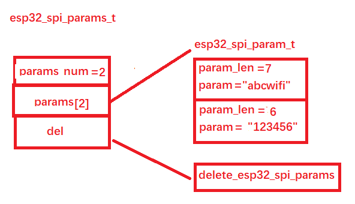
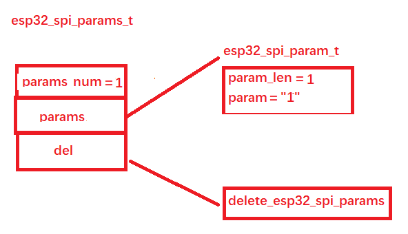

### 通过esp32_spi_connect_AP函数调用搞清楚K210-ESP32 SPI通信来龙去脉

以连接wifi热点为例，传入参数是热点名ssid和密码password：

```c
while (esp32_spi_connect_AP(WIFI_SSID, WIFI_PASSWD, 5) != 0);
```

#### 1、K210部分

首先通过 esp32_spi_params_alloc_2param 构建发送的结构体：

```c
static esp32_spi_params_t *esp32_spi_params_alloc_2param(uint32_t len_0, uint8_t *buf_0, uint32_t len_1, uint8_t *buf_1);

esp32_spi_params_t *send = esp32_spi_params_alloc_2param(strlen((const char*)ssid), ssid, strlen((const char*)passphrase), passphrase);
```

发送命令的结构体定义如下：

```c
typedef struct
{
    uint32_t params_num; // esp32_spi_param_t 参数个数
    esp32_spi_param_t **params; // 参数
    esp32_spi_params_del del;
} esp32_spi_params_t;
```

其中又有：

```c
typedef struct
{
    uint32_t param_len;
    uint8_t *param;
} esp32_spi_param_t;

typedef void (*esp32_spi_params_del)(void *arg);
```

这里的del函数为：

```c
static void delete_esp32_spi_params(void *arg)
{
    esp32_spi_params_t *params = (esp32_spi_params_t *)arg;

    for (uint8_t i = 0; i < params->params_num; i++)
    {
        esp32_spi_param_t *param = params->params[i];
        free(param->param);
        free(param);
    }
    free(params->params);
    free(params);
}
```

用于手动释放动态分配的参数，防止内存泄漏。

假设ssid=abcwifi，密码为123456，最后填充结构如下：



填充完该结构后准备调用esp32_spi_send_command_get_response函数通过SPI方式发送数据给ESP32。

```c
esp32_spi_params_t *esp32_spi_send_command_get_response(uint8_t cmd, esp32_spi_params_t *params, uint32_t *num_resp, uint8_t sent_param_len_16, uint8_t recv_param_len_16);

esp32_spi_params_t *resp = esp32_spi_send_command_get_response(SET_PASSPHRASE_CMD, send, NULL, 0, 0);
```

其中，cmd为一个枚举类型：

```c
SET_PASSPHRASE_CMD          = (0x11),
```

params 则为前面创建填充的esp32_spi_params_t结构。

在该函数中调用 esp32_spi_send_command 发送数据给ESP32:

```
esp32_spi_send_command(cmd, params, sent_param_len_16);
```

其中 sent_param_len_16 为0。

esp32_spi_send_command 会将数据继续封装发送给ESP32，封装好的数据格式如下所示：

```c
#define lc_buf_len 256
uint8_t lc_send_buf[lc_buf_len];
```

该函数首先会统计要发送数据的大小，记录到packet_len中，如果发送数据超过256字节，那么将动态分配内存：

```c
    if (packet_len > lc_buf_len)
    {
        sendbuf = (uint8_t *)malloc(sizeof(uint8_t) * packet_len);
        ...
```

发送的消息格式如下所示：


其中有：

```c
    START_CMD                   = (0xE0),
    END_CMD                     = (0xEE),
    REPLY_FLAG                  = (1<<7)
```

发送完该命令之后，返回等待ESP32的结果：

```c
return esp32_spi_wait_response_cmd(cmd, &resp_num, recv_param_len_16);

esp32_spi_params_t *esp32_spi_wait_response_cmd(uint8_t cmd, uint32_t *num_responses, uint8_t param_len_16);
```

#### 2、ESP32部分

上面已经将连接热点命令和ssid与password发送给ESP32了，可以看看ESP32做了哪些事。

ESP32使用了freertos，主要在loop()函数中等待SPI上的数据：

```c
void loop() {
  if (debug)  ets_printf(".");
  // wait for a command
  memset(commandBuffer, 0x00, SPI_BUFFER_LEN);
  int commandLength = SPIS.transfer(NULL, commandBuffer, SPI_BUFFER_LEN);
  ...
```

收到命令之后开始准备处理命令：

```c
  memset(responseBuffer, 0x00, SPI_BUFFER_LEN);
  int responseLength = CommandHandler.handle(commandBuffer, responseBuffer);
```

上面的commandBuffer, responseBuffer定义如下：

```c
uint8_t* commandBuffer;
uint8_t* responseBuffer;
```

commandBuffer 用于接收K210发送过来的数据，responseBuffer 用于返回给K210数据。

上面的handle函数定义如下：

```c
int CommandHandlerClass::handle(const uint8_t command[], uint8_t response[])
```

在该函数中会拿到对应命令的执行函数：

```c
CommandHandlerType commandHandlerType = commandHandlers[command[1]];
```

这些函数有：

```c
typedef int (*CommandHandlerType)(const uint8_t command[], uint8_t response[]);

const CommandHandlerType commandHandlers[] = {
  // 0x00 -> 0x0f
  NULL, NULL, NULL, NULL, NULL, NULL, NULL, NULL, NULL, NULL, NULL, NULL, NULL, NULL, NULL, NULL,

  // 0x10 -> 0x1f
  setNet, setPassPhrase, setKey, NULL, setIPconfig, setDNSconfig, setHostname, setPowerMode, setApNet, setApPassPhrase, setDebug, getTemperature, NULL, NULL, NULL, NULL,

  // 0x20 -> 0x2f
  getConnStatus, getIPaddr, getMACaddr, getCurrSSID, getCurrBSSID, getCurrRSSI, getCurrEnct, scanNetworks, startServerTcp, getStateTcp, dataSentTcp, availDataTcp, getDataTcp, startClientTcp, stopClientTcp, getClientStateTcp,

  // 0x30 -> 0x3f
  disconnect, NULL, getIdxRSSI, getIdxEnct, reqHostByName, getHostByName, startScanNetworks, getFwVersion, NULL, sendUDPdata, getRemoteData, getTime, getIdxBSSID, getIdxChannel, ping, getSocket,

  // 0x40 -> 0x4f
  setClientCert, setCertKey, NULL, NULL, sendDataTcp, getDataBufTcp, insertDataBuf, NULL, NULL, NULL, wpa2EntSetIdentity, wpa2EntSetUsername, wpa2EntSetPassword, wpa2EntSetCACert, wpa2EntSetCertKey, wpa2EntEnable,

  // 0x50 -> 0x5f
  setPinMode, setDigitalWrite, setAnalogWrite, getAdcValue, softReset,
};

#define NUM_COMMAND_HANDLERS (sizeof(commandHandlers) / sizeof(commandHandlers[0]))
```

我们发送的是 SET_PASSPHRASE_CMD(0x11)，所以对应的处理函数就是setPassPhrase，于是继续执行：

```c
responseLength = commandHandlerType(command, response);
```

也就是调用：

```c
setPassPhrase(command, response)；
```

该函数定义如下：

```c
int setPassPhrase(const uint8_t command[], uint8_t response[])
{
  char ssid[32 + 1];
  char pass[64 + 1];

  memset(ssid, 0x00, sizeof(ssid));
  memset(pass, 0x00, sizeof(pass));

  memcpy(ssid, &command[4], command[3]);
  memcpy(pass, &command[5 + command[3]], command[4 + command[3]]);

  WiFi.begin(ssid, pass);

  response[2] = 1; // number of parameters
  response[3] = 1; // parameter 1 length
  response[4] = 1;

  return 6;
}
```

最后也是调用了  WiFi.begin(ssid, pass) 函数连接wifi，

最后封装response数据：

```c
  if (responseLength == 0) {
    response[0] = 0xef;
    response[1] = 0x00;
    response[2] = 0xee;

    responseLength = 3;
  } else {
    response[0] = 0xe0;
    response[1] = (0x80 | command[1]);
    response[responseLength - 1] = 0xee;
  }
```

setPassPhrase函数返回值为6，说明返回数据长度为6 bytes。

返回的命令为：

```c
0xef|(0x80 | command[1])|1|1|1|0xee
```

一共六个字节。

#### 3、回到K210

```c
return esp32_spi_wait_response_cmd(cmd, &resp_num, recv_param_len_16);
```

该函数同样封装一个 esp32_spi_params_t 结构，结构体长度为

```c
response[2] = 1;
```

结构内容如下：



获取到ESP32返回的结果，然后返回到：

```c
esp32_spi_params_t *resp = esp32_spi_send_command_get_response(SET_PASSPHRASE_CMD, send, NULL, 0, 0);
```

对于发送命令，只是很简单地判断了下参数是否为1，否则返回-1：

```c
    if (resp->params[0]->param[0] != 1)
    {
#if ESP32_SPI_DEBUG
        printk("%s: Failed to set passphrase\r\n", __func__);
#endif
        resp->del(resp);
        return -1;
    }
```

```c
while (esp32_spi_connect_AP(WIFI_SSID, WIFI_PASSWD, 5) != 0);
```

这一波就结束了。

其他的都类似了。

